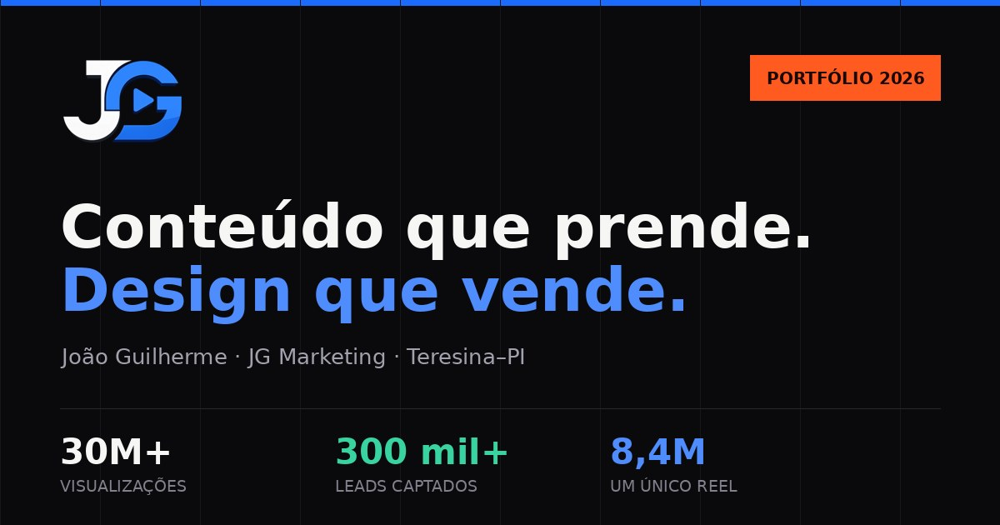

# JG Marketing — Portfólio e currículo online

Site pessoal de **João Guilherme**, profissional de marketing, conteúdo e
desenvolvimento web em Teresina–PI.

🔗 **Demo:** _adicione aqui a URL depois de publicar_



---

## Sobre

Portfólio de página única que apresenta resultados, marcas atendidas,
trajetória profissional, competências, serviços e projetos próprios —
funcionando ao mesmo tempo como currículo online e como página de captação
de clientes.

**Sem dependências.** Nenhum framework, nenhum build, nenhum `npm install`.
HTML, CSS e JavaScript escritos à mão.

---

## Como rodar

Basta abrir o `index.html` no navegador.

Para que as fontes carreguem (o navegador bloqueia `woff2` via `file://`),
prefira um servidor local:

```bash
# Python 3
python3 -m http.server 8000

# ou Node
npx serve .
```

Depois acesse `http://localhost:8000`.

---

## Publicação

### GitHub Pages
1. Envie este repositório para o GitHub
2. **Settings → Pages → Source:** `main` / raiz `/`
3. O site fica no ar em `https://<usuario>.github.io/<repositorio>/`

### Netlify / Vercel
Arraste a pasta para o painel, ou conecte o repositório. Não há comando de
build — a pasta já é o site.

Depois de publicar, troque `https://jgmarketing.com.br/` pelo endereço real em:
`index.html` (`canonical` e `og:url`), `sitemap.xml` e `robots.txt`.

---

## Estrutura

```
.
├── index.html          estrutura e conteúdo
├── css/
│   ├── style.css       design system + componentes + responsivo + impressão
│   └── fonts.css       @font-face das fontes auto-hospedadas
├── js/
│   └── app.js          interações, animações e montagem da mensagem do WhatsApp
├── assets/
│   ├── fonts/          Archivo e IBM Plex (OFL 1.1)
│   ├── retrato.webp    retrato usado na seção Perfil
│   ├── og-cover.jpg    imagem de compartilhamento
│   └── *.webp          capturas das marcas atendidas
├── site.webmanifest
├── sitemap.xml
└── robots.txt
```

---

## Design system

Tudo é controlado por tokens no topo de `css/style.css`, dentro de `:root`.
Mudar uma variável ali se propaga por toda a página.

| Grupo | Tokens |
|---|---|
| Superfícies | `--ink` `--ink-1` `--ink-2` `--ink-3` `--paper` `--paper-2` |
| Traços | `--rule` `--rule-2` `--rule-ink` `--rule-ink-2` |
| Texto | `--fg` `--fg-dim` `--fg-faint` `--on-paper` `--on-paper-dim` |
| Marca | `--blue` `--blue-hi` `--blue-deep` `--flame` `--mint` |
| Tipografia | `--display` `--body` `--mono` |
| Raio | `--r` `--r-lg` `--r-xl` `--r-pill` |
| Sombra | `--sh-sm` `--sh-md` `--sh-lg` |
| Métrica | `--shell` `--gutter` `--band` `--nav-h` `--rail-h` |
| Movimento | `--ease` `--ease-out` |

**Cor com significado:** azul para alcance, verde para conversão, laranja
apenas para oferta comercial.

---

## Funcionalidades

- Timeline de capítulos agrupada em 4 atos, arrastável e navegável por teclado
- Diagnóstico de 3 perguntas que recomenda um formato de trabalho
- Briefing que monta a mensagem do WhatsApp e salva rascunho no aparelho
- Filtro e busca nos formatos de entrega
- Lightbox nas capturas das marcas
- Barra de ações fixa e carrossel deslizante no celular
- Folha de impressão: o portfólio vira proposta em PDF
- Dados estruturados (`ProfessionalService` + `FAQPage`), sitemap e robots

---

## Acessibilidade

- Contraste conferido no critério AA da WCAG (rótulos pequenos em 5,2:1)
- Navegação por teclado com foco visível em todos os elementos interativos
- Foco preso dentro de modais, `Esc` fecha
- `prefers-reduced-motion` respeitado em toda a animação
- HTML semântico, hierarquia de títulos correta, `alt` nas imagens de conteúdo

---

## Desempenho

Medido em emulação de celular, sem cache:

| Métrica | Valor |
|---|---|
| LCP | ~230 ms |
| CLS | 0 |
| Peso transferido | ~480 KB |

Imagens em WebP com carregamento diferido, fontes recortadas para conter
apenas os caracteres usados na página, zero JavaScript de terceiros.

---

## Manutenção

**Trocar o WhatsApp:** procure por `5586994432717` em `index.html` e `js/app.js`.

**Trocar o retrato:** substitua `assets/retrato.webp` (proporção 4:5).

**Mudar as cores:** edite o bloco `:root` no topo de `css/style.css`.

**Atualizar os números do portfólio:** eles aparecem em vários pontos.
Veja a lista no `LEIA-ME.txt`.

---

## Licença

Código sob licença MIT (veja `LICENSE`).

Conteúdo, imagens, marcas e textos são de propriedade de João Guilherme e das
respectivas empresas, e **não** estão cobertos pela licença.

Fontes Archivo e IBM Plex sob SIL Open Font License 1.1 — ver
`assets/fonts/`.

---

## Contato

**João Guilherme** — Teresina–PI
[WhatsApp](https://wa.me/5586994432717) ·
[@jgmarketing__](https://www.instagram.com/jgmarketing__/) ·
joguilherme036@gmail.com
